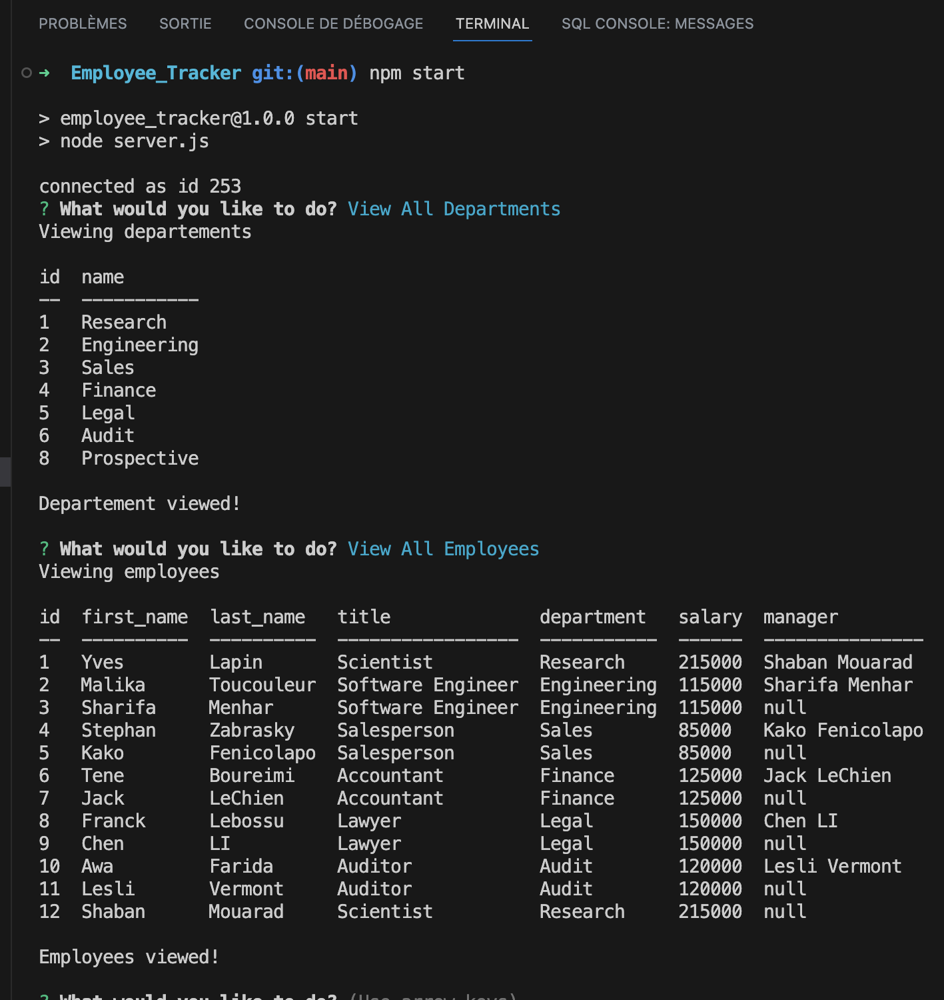
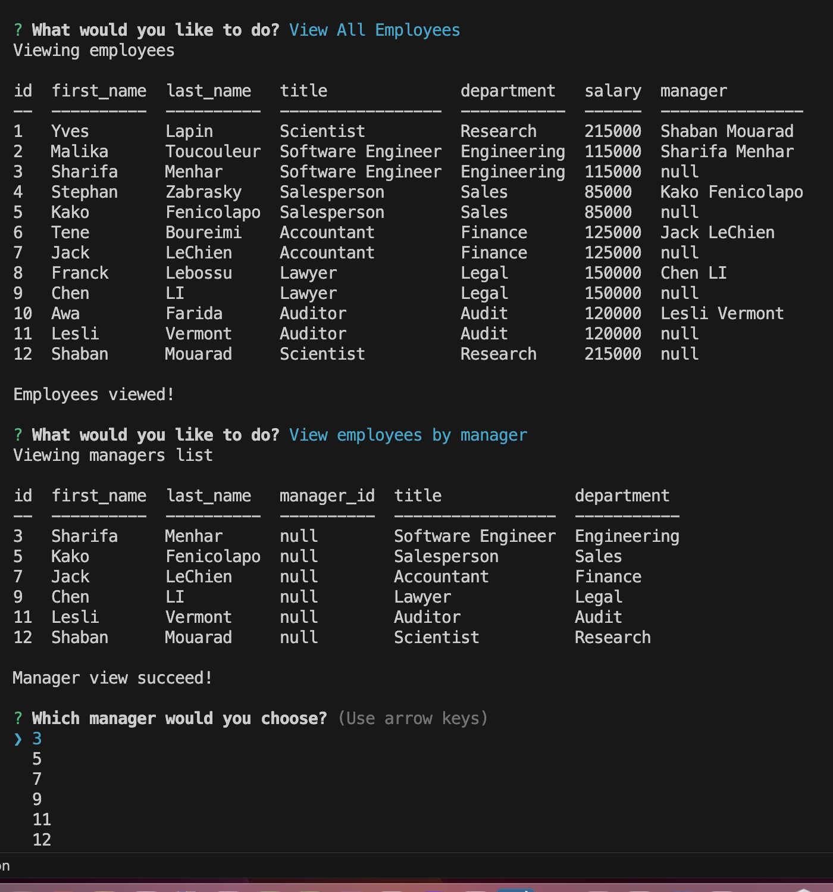
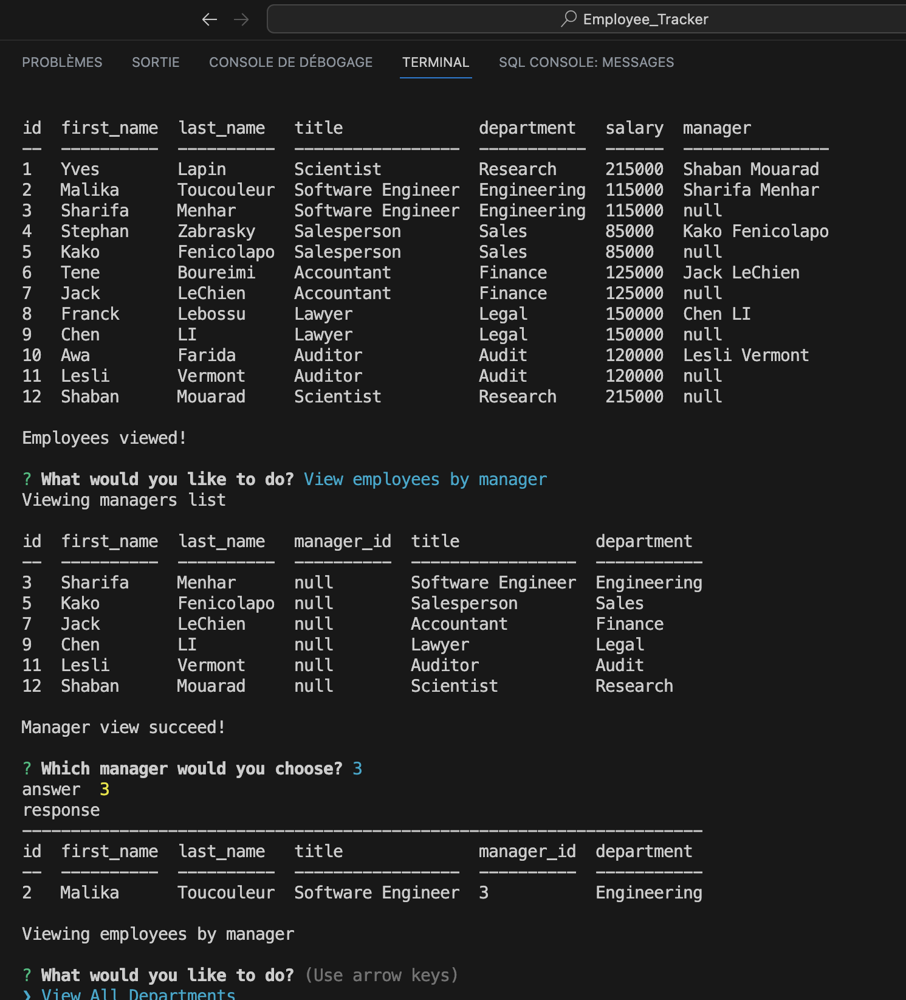

# Project: EMPLOPYEE TRACKER

 

 https://github.com/bchamidou/Employee_Tracker

 https://streamable.com/446fto

## Description
***

This folder content module to create content management systems (CMS) interfaces that allow non-developers to easily view and interact with information stored in databases. This assignment use build command-line application from scratch to manage a company's employee database, using Node.js, Inquirer, and MySQL.

## Table of Contents
***
- [Installation](#installation)
- [Project Usage](#usage)
- [Technologies](#Technologies)
- [Contributing](#contributing) 
- [Contact](#contact)
- [License](#license)

## Installation
***

The installation can be completed by following these instructions:

1. Clone the GitHub repository to you local computer. Click on the following link.
* Repository link : https://github.com/bchamidou/Employee_Tracker 
2. Install the following packages:,
    - Package.json: npm init 
    - Inquirer: npm i inquirer@8.2.4
    - MySQL2: npm i mysql2
    - console.table: npm i console.table
   
## Usage 
***
To execute the script, open a Git terminal on the main project folder (cloned folder) Run the following command: npm start

## Contributing
***

I  utilized several coding website for help, including STackOverflow, w#schools.com, and more. I also watched YouTube video tutorials and the course resources.

Any developers who are interested in contributing ideas for this application must agree to follow and comply with the Contributor Covetnant: Code of Conduct.
The Contributor Covenant Code of Conduct can be found in the following address:

[Contributor Covenant Code of Conduct](https://www.contributor-covenant.org/version/2/0/code_of_conduct/code_of_conduct.md/)

## Technologies
***

Technologies used: 
 - Node.js
 - Inquirer (https://www.npmjs.com/package/inquirer/v/8.2.4)
 - MySQL (https://www.npmjs.com/package/mysql2)
    

## Contact
***

For additional questions, please contact bchamidou@gmail.com.
or my Github page:(https://github.com/bchamidou)

## License
***

This application is covered under the MIT License.

Copyright (c) 2023 bchamidou.

    This software/code is licensed under the MIT License; 
    to use this software/code you must agree to follow and comply the License.
    A copy of the License can be found at: https://www.gnu.org/licenses/gpl-3.0.md 

